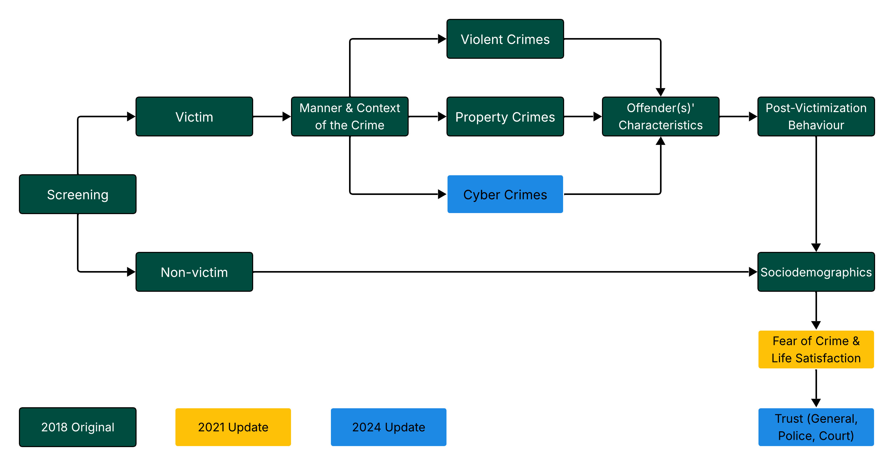
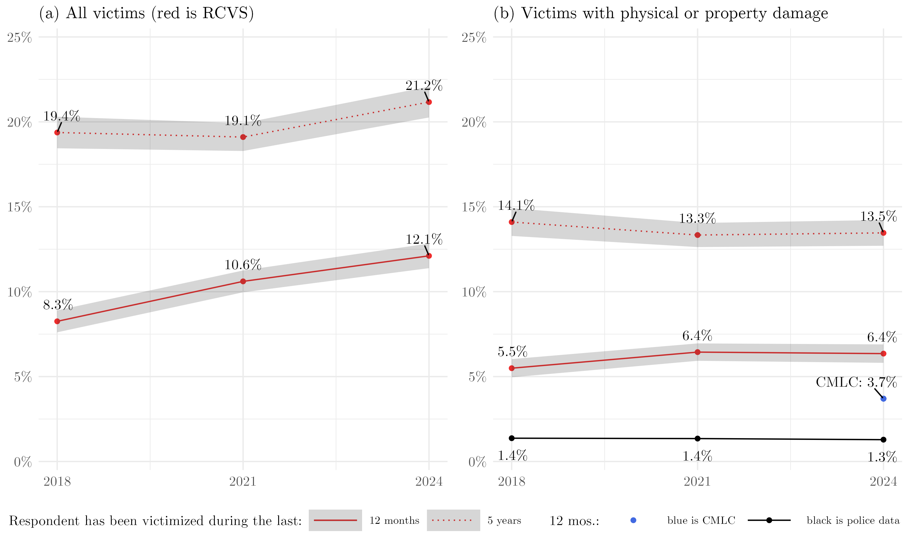
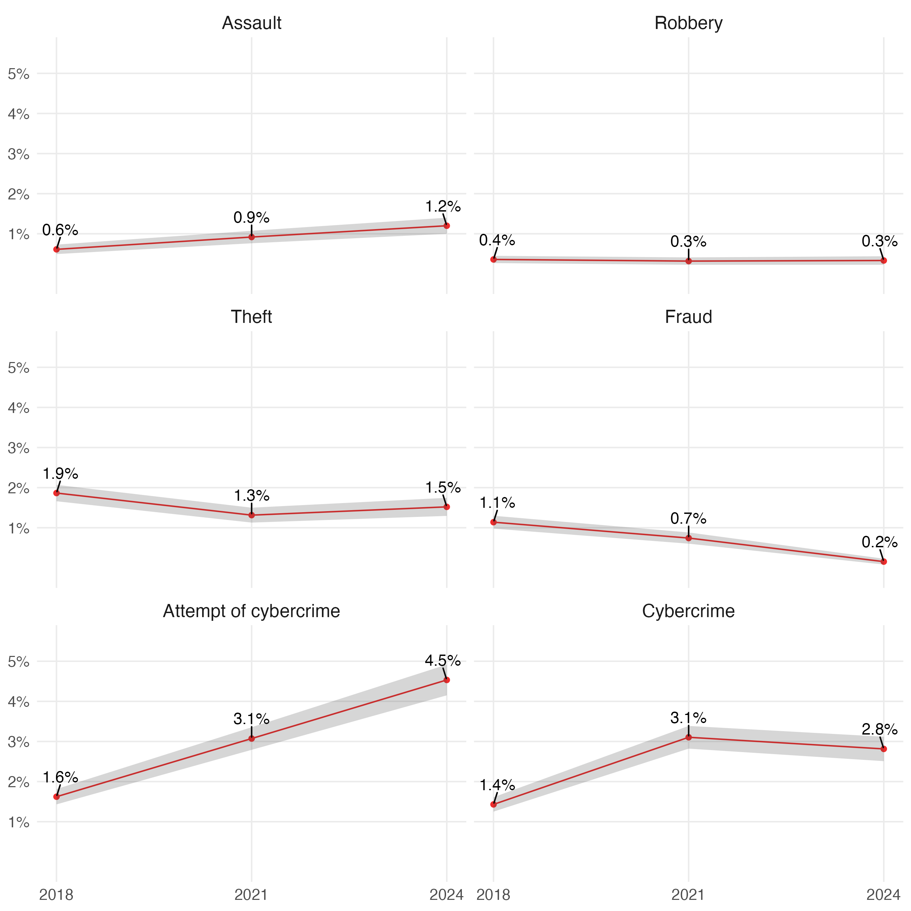

# Russian Crime Victimization Survey (RCVS)

[](https://creativecommons.org/licenses/by/4.0/)  [](https://papers.ssrn.com/sol3/papers.cfm?abstract_id=6418058)      [](https://dataverse.harvard.edu/dataset.xhtml?persistentId=doi:10.7910/DVN/ISMDV5)     

This replication package accompanies [the paper](https://papers.ssrn.com/sol3/papers.cfm?abstract_id=6418058). It documents steps to prepare a pooled dataset, and produces figures in the paper about RCVS.

The Russian Crime Victimization Survey (RCVS): harmonized pooled data from three nationally representative cross-sections (2018, 2021, 2024) and a longitudinal component (2021–2024). The RCVS is the only repeated nationwide victimization survey in Russia.

— The survey is conducted triennially (every three years) and is representative at the national level.

— The target population includes the entire adult population of Russia, regardless of citizenship status.

— The survey is administered via telephone using the CATI mode (Computer-Assisted Telephone Interviewing).

— Each cross-section wave employs Random Digit Dialing (RDD).

— The sample includes both victims and non-victims of crime.

— Across the three waves (2018, 2021, 2024), a total of 42,572 respondents were interviewed, with 3,456 re-interviewed as part of a panel (longitudinal) sample (2021–2024).

### Questionnaire and Screening Logic

<div align="center" width="60%">
    
</div>
<br>

<br>

## Data

Underlying RCVS data are available in three Harvard Dataverse repositories. This repository already contains copy of needed datasets from these repositories.

— [Russian Crime Victimization Survey 2018](https://dataverse.harvard.edu/dataset.xhtml?persistentId=doi:10.7910/DVN/C2OTH9)

— [Russian Crime Victimization Survey 2021](https://dataverse.harvard.edu/dataset.xhtml?persistentId=doi:10.7910/DVN/SGRQTI)

— [Russian Crime Victimization Survey 2024](https://dataverse.harvard.edu/dataset.xhtml?persistentId=doi:10.7910/DVN/WMO7Y2)

This replication package produces a pooled dataset, also available on Harvard Dataverse:

— [Russian Crime Victimization Survey: Pooled Cross-Sections 2018, 2021, 2024, and Panel 2021–2024](https://dataverse.harvard.edu/dataset.xhtml?persistentId=doi:10.7910/DVN/ISMDV5)

## Paper

See [the preprint](https://papers.ssrn.com/sol3/papers.cfm?abstract_id=6418058). It contains a detailed description of the survey methodology, including internal and external validation, the procedure for calculating post-stratification weights for the cross-sectional subsample, and the correction for non-response bias (attrition) in the panel sample.

## Usage Notes

The replication package recreates a harmonized pooled dataset that combines 2018-2024. It saves the resulting dataset in various formats and accompanying codebooks in `/results` folder. It also recreates figures used in the paper and saves them into `/figures` folder.

### Quick start

This will download the archive of this repository, unzip it into the folder `rcvs-main`, and replicate the code.

``` r
download.file(url = "https://github.com/irlcode/RCVS/archive/master.zip", destfile = "rcvs.zip")
unzip(zipfile = "rcvs.zip")
source("rcvs-main/code/00_master_script.R")
```

### Manual

1.  Download the repository: scroll up, find and click green button `<>Code` -\> `Download ZIP`. Download and unzip.
2.  Run `00_master_file.R` within `/code` folder.

It will sequentially execute scripts to preprocess and merge datasets, and then reproduce the figures from the outputted dataset.

### Partially reproducible scripts

Several scripts used for preparing survey weights and raking are not fully reproducible due to data limitations. We publish them in the folder `04_non_reproducible`. Scripts for processing official Rosstat data used for bias estimation and weighting.

— Demographics: `04a_extract_age_region_distributions.r` and `04b_extract_educ_distribution.R` extract population moments from Rosstat [yearbooks](https://rosstat.gov.ru/compendium/document/13284) and the [2020 Census](https://rosstat.gov.ru/vpn/2020/Tom3_Obrazovanie) to compute post-stratification weights.

— CMLC (KOUZH): `04c_prepare_kouzh_data.r processes` the [Comprehensive Monitoring of Living Conditions (2018–2024)](https://rosstat.gov.ru/itog_inspect). Due to the prohibitive size of raw files, we provide the processed outputs in `data/auxdata/`.

— Panel Attrition: `04e_define...` and `04f_compute...` handle attrition corrections between 2021 and 2024. Contact propensity estimation requires survey paradata (call attempts), which are currently non-public.

## Victimization trends

These figures from the paper are produced by script `code/02_produce_figures.R`:

#### Dynamics of Victimization in Russia, 2018–2024

<div align="center" width="60%">
    
</div>
<br>

#### Annual Adult Victimization by Crime Types in Russia over 2018–2024

<div align="center" width="60%">
    
</div>
<br>


## Structure of repository

``` bash
├── code
│   ├── 00_master_script.R
│   ├── 01a_gather_repeated_crosssections.R
│   ├── 01b_gather_panel.R
│   ├── 01c_attach_deflators.R
│   ├── 01d_attach_panel_weights.R
│   ├── 01e_export_data.R
│   ├── 01f_prepare_english_version.R
│   ├── 01g_rendering_codebooks.R
│   ├── 02_produce_figures.R
│   ├── 03_power_analysis.R
│   ├── 04_non_reproducible
│   │   ├── 04a_extract_age_region_distributions.r
│   │   ├── 04b_extract_educ_distribution.R
│   │   ├── 04c_prepare_kouzh_data.r
│   │   ├── 04d_raking_weights_for_crosssection.r
│   │   ├── 04e_define_final_dispositions_codes.R
│   │   └── 04f_compute_weights_for_cohort.r
│   └── aux_code
│       ├── codebook_pooled_data_eng.Rmd
│       ├── codebook_pooled_data_rus.Rmd
│       ├── codebook_variables_changes_eng.Rmd
│       ├── codebook_variables_changes_rus.Rmd
│       ├── img
│       │   ├── eusp_logo_eng.png
│       │   ├── eusp_logo.png
│       │   ├── ipp_logo_eng.png
│       │   └── ipp_logo.png
│       └── R_function_ci4prev.r
├── data
│   ├── auxdata
│   │   ├── computed_panel_weights_13mar26.rdata
│   │   ├── computed_raking_weights_17apr25.rdata
│   │   ├── federal_district_population_educ.csv
│   │   ├── federal_district_population_sex_agegroup_yearly.csv
│   │   ├── kouzh_18_20_22_24_5sep25.rdata
│   │   ├── kouzh_victim_24.rdata
│   │   ├── official_crime_rate.xlsx
│   │   ├── region_educ_population_census.csv
│   │   └── region_sex_age_yearly_population_2018_2024.csv
│   ├── rcvs_2018_dataset_2026-03-14.Rds
│   ├── rcvs_2021_dataset_2026-03-14.Rds
│   ├── rcvs_panel_2024_2026-03-14.Rds
│   ├── rcvs_rdd_2024_2026-03-14.Rds
│   └── supplementary_data
│       ├── all_var_names_fixed.csv
│       ├── codebook_all_waves_eng.csv
│       ├── codebook_all_waves_rus.csv
│       ├── codebook_panels_eng.csv
│       ├── english_version
│       │   ├── all_waves_values.xlsx
│       │   ├── all_waves_variables.xlsx
│       │   ├── panels_values.xlsx
│       │   ├── panels_variables.xlsx
│       │   └── rcvs_regions_iso_keys.xlsx
│       ├── key_pairs_panel.csv
│       ├── key_pairs_rdd.csv
│       ├── panels_var_names_fixed.csv
│       └── qof_changes.csv
├── figures
│   ├── age_plot.png
│   ├── crimetype_plot.png
│   ├── prevalence_plot.png
│   └── rcvs_flow.png
└── README.md
```

## ToDo

-   [ ] Computing weights for combining the 2024 refreshment (cross-sectional) and panel samples ([Watson, 2014](https://ojs.ub.uni-konstanz.de/srm/article/view/5818), [Watson, Lynn, 2021](https://onlinelibrary.wiley.com/doi/abs/10.1002/9781119376965.ch1)).
-   [ ] Calculating wave-specific post-stratification weights for each cross-sectional sample.

## Licence

<a rel="license" href="https://creativecommons.org/licenses/by/4.0/"></a><br /> Creative Commons License Attribution 4.0 International (CC BY 4.0).

## Citation

Please cite as:

> Kuchakov, R., Serebrennikov, D., Bobrikov, D., Knorre, A., & Skougarevskiy, D. (2026). Russian Crime Victimization Survey: Pooled Cross-Sections and a Longitudinal Panel, 2018–2024 (SSRN Scholarly Paper No. 6418058). Social Science Research Network. <https://papers.ssrn.com/abstract=6418058>

``` tex
@article{kuchakov2026rcvs,
  title={{R}ussian {C}rime {V}ictimization {S}urvey: {P}ooled {C}ross-{S}ections and a {L}ongitudinal {P}anel, 2018–2024},
  author={Kuchakov, Ruslan and Serebrennikov, Dmitriy and Bobrikov, Dmitriy and Knorre, Alex and Skougarevskiy, Dmitriy},
  journal={Social Science Research Network (SSRN)},
  note={\url{https://papers.ssrn.com/sol3/papers.cfm?abstract_id=6418058}},
  year={2026},
}
```

## Contacts

Ruslan Kuchakov, [rkuchakov@eu.spb.ru](mailto:rkuchakov@eu.spb.ru)
